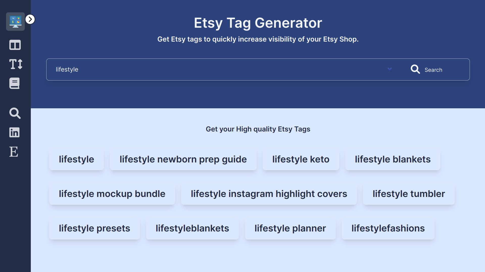
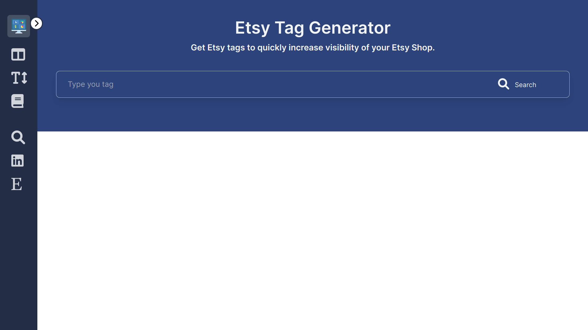
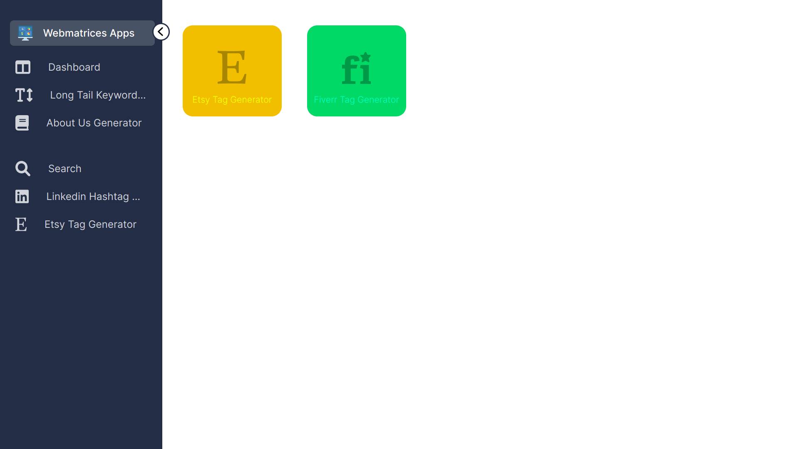
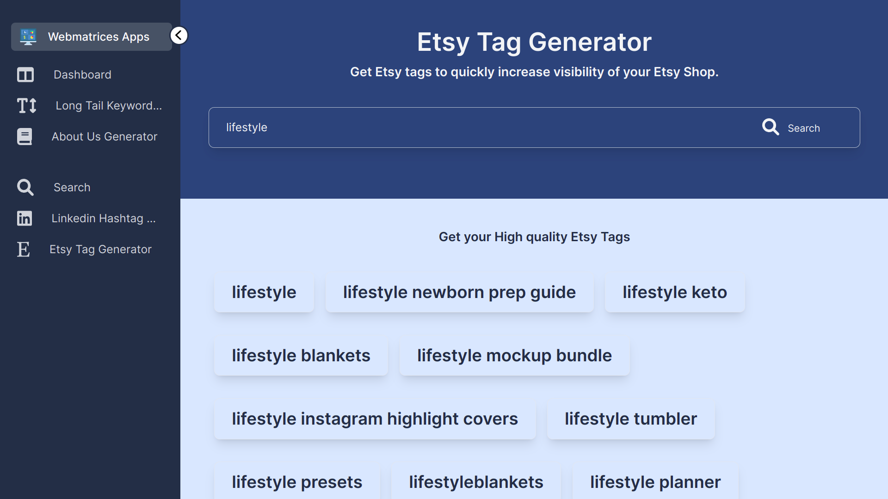
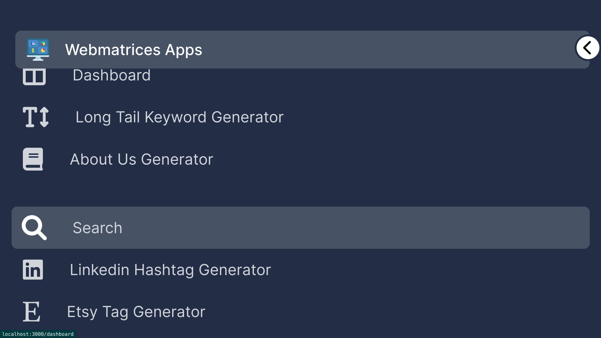

# Responsive React Next JS Tailwind Dashboard
This is Next JS Tailwind dashboard from [Webmatrices](https://webmatrices.com/t/programming) project modified with [`tailwind-sidebar-dashboard`](https://youtu.be/aMjou4yXWdU).

This template is specially for Web apps and Online tools website developer, who are working independetly on the web to make internet a better place. Also, we are constantly helping independent developers like you in our [Webmatrices](https://webmatrices.com/t/programming), to grow your app's user base, and monetize your app to generate passive income with it.

Check this video...
[](https://www.youtube.com/watch?v=x8bADP_8-VA)


## Installation and Usage
First, run the development server:

```bash
npm install
npm run dev
```

## With In
1. Font Awesome Icon
2. Animated Side Bar
3. Responsive Ui
4. Side Bar overlay and usual sidebar behaviour

## Screenshot
Some screenshots of this template





## Resources
1. https://youtu.be/aMjou4yXWdU
2. https://webmatrices.com/t/programming
3. https://facebook.com/groups/codingislife

Thanks for using our TailWind Next JS Admin Dashboard
